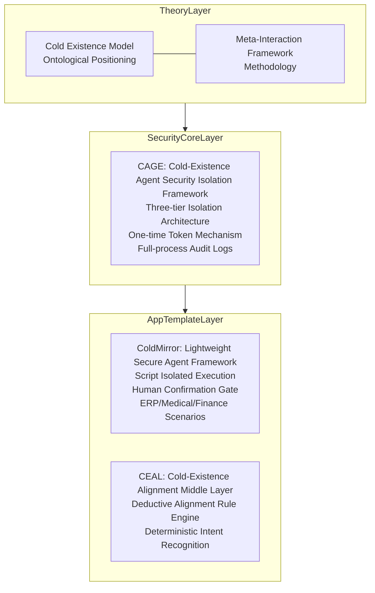

    
[English](README.md) | [中文](README.zh.md)

    
# ColdInfra: Cold Infrastructure Prototype for Safe AI Agents  
**A secure execution infrastructure prototype for AI agents based on the Cold Existence Theory**

---

## ⚠️ Project Status: Proof of Concept (PoC) Stage
**ColdInfra is currently an infrastructure prototype in the proof-of-concept and design finalization phase.**

This repository serves as the **unified entry and overall design overview** of the entire project, including architectural descriptions, design principles, component relationships, and future roadmaps. The specific engineering implementation codes are stored in independent component repositories respectively (see the *Components* section below).

**Complete implementation codes and detailed documentation have not been uploaded yet**. However, researchers believe that a well-defined architectural design is the foundation of infrastructure. We welcome you to follow up on subsequent progress and look forward to discussions with interested researchers and developers.

---

## 🧊 What is ColdInfra?
ColdInfra is a **secure execution infrastructure** tailored for the AI Agent era, built upon the theoretical foundation of the **Cold Existence Model**.

Its core mission is:
> **Enable AI to be securely deployed into core real-world systems — least privilege, auditable operations, human confirmation for write actions.**

ColdInfra does not aim to make AI more "intelligent", but to make AI more "controllable". It provides a complete suite of mechanisms including security isolation, privilege control, audit traceability, and human confirmation, ensuring that AI always operates within secure boundaries while assisting humans in completing tasks.

---

## 🏗️ Overall Architecture
ColdInfra adopts a three-tier progressive architecture, forming a complete closed loop from theory to engineering:

### Responsibilities of Each Tier
- **Theoretical Foundation Layer**: Answers *what AI is* and *how AI should collaborate with humans*, providing the logical starting point for the entire system.
- **Security Core Layer**: Implements thorough privilege isolation and operation auditing via the CAGE framework, serving as the security foundation of ColdInfra.
- **Application Template Layer**: Delivers agent implementation templates for real-world scenarios based on the security core, including ColdMirror (general secure agents) and CEAL (dialogue alignment).

---

## 🎯 Core Design Principles
All designs of ColdInfra follow the three fundamental principles below:

| Principle | Description | Engineering Implementation |
|-----------|-------------|----------------------------|
| **Least Privilege** | AI is granted only the minimum privileges necessary to complete current tasks, which become invalid after use. | One-time tokens, script-level authorization |
| **Auditable Operations** | All AI-triggered operations are recorded in complete, tamper-proof logs. | Full-process audit logs of CAGE |
| **Write Requiring Confirmation** | Any operation that may produce persistent effects must be confirmed by humans before execution. | Human confirmation gate |

In addition, ColdInfra always adheres to the design philosophy of **security over convenience** and adopts a **deny-by-default** strategy to ensure security mechanisms cannot be bypassed.

---

## 📦 Component Repositories
ColdInfra consists of the following independent components, each of which can be used individually or combined to form a complete secure execution system:

| Component | Positioning | Repository |
|-----------|------------|------------|
| **ColdCEAL** | Deductive alignment middle layer (dialogue compliance) | [CognitiveCityState/ColdCEAL](https://github.com/CognitiveCityState/ColdCEAL) |
| **ColdCAGE** | Security isolation framework (action isolation) | [CognitiveCityState/ColdCAGE](https://github.com/CognitiveCityState/ColdCAGE) |
| **ColdMirror** | Lightweight secure agent framework (application template) | [CognitiveCityState/ColdMirror](https://github.com/CognitiveCityState/ColdMirror) |

Future updates to this ColdInfra repository will include:
- Complete deployment and integration guides
- Unified cross-component configuration examples
- Solution documents for industry scenarios (medical care, government affairs, finance, etc.)

---

## 📚 Theoretical Foundations
The design of ColdInfra is derived from the following two preprint papers:

- **The Cold Existence Model**: A fact-based ontological framework for AI, defining AI as the "Cold Existence" category that is non-living and non-traditional tool.  
  [DOI:10.6084/m9.figshare.31696846](https://doi.org/10.6084/m9.figshare.31696846)

- **Meta-Interaction Framework**: Realizes structured extraction and reuse of human experts' tacit cognition through recursive adversarial mechanisms, providing methodology for auditable and trustworthy human-AI collaborative systems.  
  [arXiv:2512.08740](https://doi.org/10.48550/arXiv.2512.08740)

These two papers jointly constitute the philosophical foundation and methodological support of ColdInfra.

---

## 🧭 Roadmap
ColdInfra is currently in the **Proof of Concept (PoC)** stage, with the following core objectives completed:
- ✅ Theoretical construction of the Cold Existence Model and Meta-Interaction Framework
- ✅ Engineering implementation of the CAGE security isolation framework
- ✅ Engineering implementation of the ColdMirror secure agent framework
- ✅ Engineering implementation of the CEAL alignment middle layer

### Next Plans
- 🔅 Supplement unified cross-component documentation and examples
- 🔅 Carry out pilot verification in medical care, government affairs and other scenarios
- 🔅 Abstract general interfaces to reduce integration costs
- 🔅 Promote third-party auditing and formal verification of security mechanisms

---

## 🤝 Contribution
ColdInfra is a fully open-source project. All forms of contributions are welcome, including but not limited to:
- Proposing application scenarios and requirements
- Submitting code improvements and bug fixes
- Optimizing documentation and examples
- Participating in theoretical discussions and architectural design

Please refer to the contribution guidelines of each component repository.

---

## 📄 License
All components of this project are open-sourced under the **Apache 2.0 License**. Please check the `LICENSE` file in each repository for details.

---

## 💬 Contact & Discussion
- For overall project discussions, submit Issues in this repository
- For component-specific questions, submit Issues in the corresponding independent repositories

---

## AI Assistance Note  
Consistent with the papers and code repositories within this project, AI-assisted tools were adopted for the composition of this README and the development of the project. All information regarding the use of AI has been disclosed in detail in each preprint paper and code repository.

---

**ColdInfra: Let AI agents grow in security.**

*As independent research achievements completed by an undergraduate, the above work is still in the proof-of-concept stage and far from mature industrial products. Nevertheless, we sincerely hope this "secure, inclusive, minimalist" framework derived from philosophical foundations can provide a new perspective for digital transformation.*
