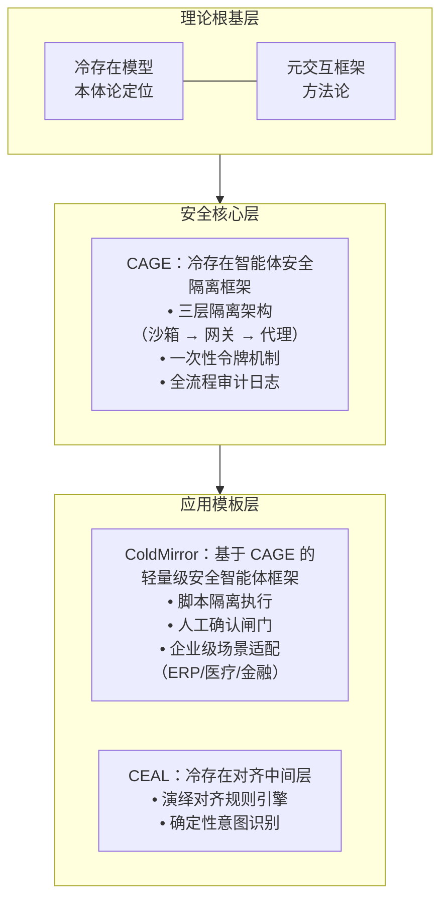

# ColdInfra

**Cold Infrastructure Prototype for Safe AI Agents**

*基于冷存在理论的智能体安全执行基础设施原型*

---

## ⚠️ 项目状态：概念验证（PoC）阶段

**ColdInfra 目前是一个基础设施的雏形，正处于概念验证与设计定型阶段。**

本仓库作为整个项目的**统一入口与设计总览**，包含架构说明、设计原则、组件关系及未来规划。具体的工程实现代码分别位于独立的组件仓库中（见下方“组件”部分）。

**当前尚未上传完整的实现代码与详细文档**，但研究者相信清晰的架构设计是基础设施的根基。欢迎关注后续进展，也期待与感兴趣的研究者、开发者共同探讨。

---

## 🧊 什么是 ColdInfra？

ColdInfra 是一套从**冷存在模型**（Cold Existence Model）理论根基出发，面向智能体（AI Agent）时代的**安全执行基础设施**。

它的核心使命是：

> **让 AI 可以被安全地部署到真实世界的核心系统中——权限最小化、操作可审计、写入需确认。**

ColdInfra 不是让 AI 更“聪明”，而是让 AI 更“可控”。它为智能体提供了一整套安全隔离、权限控制、审计追溯和人工确认机制，确保 AI 在协助人类完成任务的同时，始终运行在安全的边界之内。

---

## 🏗️ 架构总览

ColdInfra 采用三层递进式架构，从理论到工程形成完整闭环：

**各层职责：**
- **理论根基层**：回答“AI 是什么”以及“AI 应如何与人类协作”，为整个体系提供逻辑起点。
- **安全核心层**：通过 CAGE 框架实现彻底的权限隔离与操作审计，是 ColdInfra 的安全底座。
- **应用模板层**：基于安全核心，提供面向真实场景的智能体实现模板，如 ColdMirror（通用安全智能体）和 CEAL（对话对齐）。

---

## 🎯 核心设计原则

ColdInfra 的所有设计都遵循以下三条基本原则：

| 原则 | 说明 | 工程体现 |
|------|------|---------|
| **权限最小化** | AI 只拥有完成当前任务所必需的最小权限，用完即废。 | 一次性令牌、脚本级授权 |
| **操作可审计** | 所有 AI 触发的操作必须有完整的、不可篡改的日志。 | CAGE 全流程审计日志 |
| **写入需确认** | 任何可能产生持久影响的操作，必须经人类确认后方可执行。 | 人工确认闸门 |

此外，ColdInfra 始终贯彻**安全优先于便利**的设计哲学，采用 **默认拒绝** 策略，确保安全机制不可绕过。

---

## 📦 组件仓库

ColdInfra 由以下独立组件构成，每个组件均可单独使用，也可组合形成完整的安全执行体系：

| 组件 | 定位 | 仓库 |
|------|------|------|
| **ColdCEAL** | 演绎对齐中间层（对话合规） | [CognitiveCityState/ColdCEAL](https://github.com/CognitiveCityState/ColdCEAL) |
| **ColdCAGE** | 安全隔离框架（行动隔离） | [CognitiveCityState/ColdCAGE](https://github.com/CognitiveCityState/ColdCAGE) |
| **ColdMirror** | 轻量级安全智能体框架（应用模板） | [CognitiveCityState/ColdMirror](https://github.com/CognitiveCityState/ColdMirror) |

未来，本仓库（ColdInfra）将逐步补充：
- 完整的部署与集成指南
- 跨组件的统一配置示例
- 面向行业场景的解决方案文档（医疗、政务、金融等）

---

## 📚 理论根基

ColdInfra 的设计源自以下两篇论文（预印本）：

- **冷存在模型**：一个基于事实的 AI 本体论框架，将 AI 界定为“非生命、非传统工具”的“冷存在”范畴。  
  [DOI:10.6084/m9.figshare.31696846](https://doi.org/10.6084/m9.figshare.31696846) 

- **元交互框架**：通过递归对抗机制实现人类专家隐性认知的结构化提取与复用，为可审计、可信任的人机协同系统提供方法论。  
  [arXiv:2512.08740](https://doi.org/10.48550/arXiv.2512.08740)

这两篇论文共同构成了 ColdInfra 的哲学根基与方法论支撑。

---

## 🧭 发展路线

ColdInfra 目前处于 **概念验证（PoC）** 阶段，主要目标已完成：
- ✅ 冷存在模型与元交互框架的理论构建
- ✅ CAGE 安全隔离框架的工程实现
- ✅ ColdMirror 安全智能体框架的工程实现
- ✅ CEAL 对齐中间层的工程实现

**下一步计划：**
- 🔲 完善跨组件的统一文档与示例
- 🔲 开展医疗、政务等场景的试点验证
- 🔲 抽象通用接口，降低集成成本
- 🔲 推进安全机制的第三方审计与形式化验证

---

## 🤝 参与贡献

ColdInfra 是一个完全开放的项目。我们欢迎任何形式的贡献，包括但不限于：
- 提出使用场景与需求
- 提交代码改进与 bug 修复
- 完善文档与示例
- 参与理论探讨与架构设计

请参考各组件仓库的贡献指南。

---

## 📄 许可证

本项目各组件均采用**Apache 2.0 许可证**开源。详情请参见各仓库的 LICENSE 文件。

---

## 💬 联系与讨论

- 项目整体讨论请在本仓库提交 Issue
- 各组件相关问题请分别在对应仓库提交 Issue

---

## 关于 AI 辅助  
与项目中的论文和代码仓库一致，本 README 的撰写及项目开发过程中使用了 AI 辅助工具。所有 AI 使用情况已在各论文预印本及代码仓库中详细披露。

---

**ColdInfra：让智能体在安全中生长。**

*作为本科生独立探索的成果，以上工作尚处于概念验证阶段，距离成熟产品仍有较大差距。但衷心希望这套从哲学根基生长出的“安全、普惠、简约”的框架，能为数字化转型提供一种新的思考视角。*
